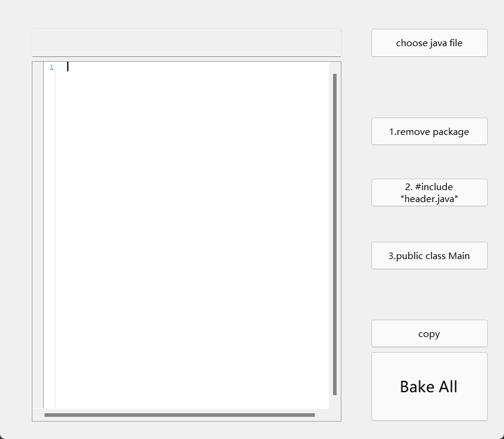

# Online Judge Java Submission Helper
> Java OJ 自动提交助手,  叶璨铭: 12011404@mail.sustech.edu.cn
> 
> **警告:** 该项目未来不再更新，请在本README文档的 `项目发展` 一栏查看本项目的后继项目: `OneJava`

`Java OJ 自动提交助手` 是一个工具项目，旨在让`数据结构与算法分析` `算法竞赛`的 OJ 提交Java代码过程更加容易。

本项目的主要目标是

- 加速Java玩家在写作业、参加算法竞赛时的提交速度
- 满血支持Java面向对象的`数据结构与算法分析` 编程方式
- 支持Java包管理机制。

让你的`数据结构与算法分析`学习旅程更加具有探索性和启发性。

### 目录
- 简介
- 快速入门
- 详细功能特性与文档
- 项目发展
## 简介
> 在一切开始之前，让我们先讲个故事吧。
>
> 故事发生在盛夏的一个平凡的日子，在 SUSTech 教学楼的某间教室里，孩子们在教室里做着 DSAA 的 lab 作业。一切安详又美好。
>
> 如果故事就这样平凡地进行下去，大家都规规矩矩地做完了作业，那自然是没有什么看头的。这篇引言也大致可以说就结束了。

> 但事实不然，在 SUSTech Online Judge 网站上，有着许许多多的练习题要我们去完成。而除了阅读题目，做适当的翻译，转换成形式化的描述，推导证明易于导出答案的有关性质，写出能够解决问题的程序代码以外，我们还有不可或缺的一步：**将写出的程序代码上交到 OJ 上**。

> 而这个 OJ 呀，有点小小的乖张和高傲——**它要求你必须只上传一份代码。**
>
> 考虑到 Java 是一门面向对象的程序设计语言，以类作为解决问题的基本单位，因此你需要将**解决方案的类名修改成 Main,** 并且如果你写了多个类——**你需要将它们全部一一拷贝到同一个文件下，并相应地检查运行结果，以便于你确认「聚拢」后的代码没有权限、语法等方面的错误。**
>
> 众所周知，这个过程枯燥无味，作为一名 CS 学生，有什么理由忍受这种愚蠢的时间浪费呢？
>
> 因此，某名同学突然突发奇想，实验性地制造了一个通过类似宏命令的特殊描述，指示性地聚合了多个类文件！

没错! `Java OJ 自动提交助手`正是一款小巧而强大的工具，让你专注于思考`数据结构与算法分析`的题目本身而不是OJ繁琐的提交过程。
可以说，我们的工作让`数据结构与算法分析`的学习与思考更加容易；我们的工作让Java成为完成`数据结构与算法分析`作业的自然而优雅的一门语言。

## 快速入门
`Java OJ 自动提交助手`的工作流程十分简单：



### 0.导入Java文件

首先，你需要导入一个拥有`public static void main(String[])`方法的Java文件 

- 将来提交OJ时，提交上去的Main.java的main逻辑上应当等价于这个文件的main。

- 当然，我们知道一个文件有可能有`包内可访问类`（没有限定符），这些类也是有`public static void main(String[])`方法的

- 为了避免冲突

- 你需要在**OJ提交主类**（也就是你想要让OJ执行的main所在的类）的声明前使用如下注释

  `//# pragma OJ Main`， 例如

```java
//ProblemA.java
package lab11_bonus;

//# pragma OJ Main

public class ProblemA {
    public static void main(String[] args) {
        //my oj main
    }
}
class PackageAccessibleClass{
    public static void main(String[] args) {
		// I don't want this main to run in OJ.
    }
}
//# include "OnlineJudgeIO.java"
```

- 其中，形如`//#`的注释我们称为**Java宏命令**，特定的Java宏命令能够被我们的自动提交工具识别。
- `pragma OJ Main`就是一个**Java宏命令**，用于指示OJ工具下面马上要声明的类是**OJ提交主类**。
- 其中，OJ 可以大写也可以小写，Main可以写为main，`// #`的空格数量也不会影响程序识别。我们的工具非常稳定。
- 除了我们在快速入门给出的宏命令之外，其他`//#`都为正常的Java注释。

> **TIP**: 选择后的文件内容存在于小工具的内存当中，修改文本框中的文字不会修改你原来的文件代码、提交OJ的代码是你原来代码拷贝后进行了一些自动编辑后提交的。

### 1. remove package

- 对于上面的代码示例`ProblemA.java`
  - 而**每周的lab都是A-F题，也即是说Java文件名不可避免会重复.**
  - 作者为了管理自己的数据结构学习代码
  - 采用了Java的包管理方法，第11周的bonus_lab放在了`package lab11_bonus;`下。
- 然而，对于OJ上我们要提交的**单文件Java项目**来说，不能存在个人的项目包管理。
- 点击1.remove package按钮，你就能在提交OJ前快速去除本地代码的package，而且保证逻辑仍然是正确的。

### 2. 核心功能 include 

你可能注意到了在`ProblemA.java`的末尾有一行代码`//# include "OnlineJudgeIO.java"` 这是什么意思呢？我们不妨来看一道OJ题目的实现代码：

```java
//ProblemA_Sorting.java
package lab2_sorting;

import java.util.Arrays;

//# pragma OJ Main
public class ProblemA_Sorting {
    private static OJReader in = new OJReader();
    private static OJWriter out = new OJWriter();
    public static void main(String[] args) {
        // read the array from oj when the first line is the length of the array
        final int[] ints = in.nextIntArray(in.nextInt()); 
        //sort the array and print to oj.
        out.printlnIntArray(MySort.sort(ints));
    }
}
//# include "OnlineJudgeIO.java"
//# include "MySort.java"
```

这道题要求输入一个数组，输出一个排序好的数组。

#### 代码解释

这里的代码中，代码作者写了三个自定义类`OJReader`, `OJWriter`和`MySort`. 

这三个类都在`package lab2_sorting`下，其中`OJReader`, `OJWriter`在同一个文件"OnlineJudgeIO.java"中（他们都不是public class）

在分析到include字段时，自动提交工具将把对应的代码抄写到//# include的位置

#### 为什么要写成这样？

1. 为什么不直接用`Scanner`和`System.out.println`?

- 在一些题目中，你需要使用**快读快写**才能AC
- 与其每次都写一个快读快写，不如 Write Once， use anytime.
- 此外，你可能已经注意到了，当你需要时，你可以自己写nextIntArray()方法，实现比直接for循环快速的OJ数组读入。
- 我们的快速提交工具为您提供了不用复制粘贴代码的稳定解决方案。

2. MySort是什么鬼？

- 在南科大的`数据结构与算法分析`课中，你在学习排序算法时，应当手动实现，而不能调系统库。
- 如果每道题的排序你都抄写一遍你写的排序算法，未免有些繁琐。
- 使用快速提交工具，你只是复制粘贴了一个include语句，剩下的复制粘贴让工具帮你完成。

#### 如何操作

- 使用前


- 使用后

  

  可以看到，OJReader和OJWriter 所依赖的系统类，也自动抄写到了最上方，remove package后应该就正常了。

### 3. 改Main

将0.中所述的类改名为Main

### Bake all

自动完成上述所有步骤

### copy

复制编辑完的文本，以便你粘贴到OJ提交栏。

## 为什么要用`Java OJ 自动提交助手`?
### 使用面向对象的Java语言有利于更好地描述数据结构

### OJ只允许提交一个文件并不是个别现象。
在诸如 LeetCode, 洛谷, SUSTech OJ 等各种算法网站上，使用Java语言进行提交往往都只能提交一个文件。对于Java面向对象玩家来说，这并不是很方便。

### `Java OJ 自动提交助手` 并不止于多文件智能聚合
#### 智能语言版本转换
在洛谷提交Java代码时，你只能提交`Java 8` 版本，
而C++则允许现代的`C++11`, `C++14` 乃至 `C++17`
> _“对于一个var(Java 11 相比 Java 8 的新(?唯一)功能)重度依赖者，这怎么能忍!”_

于是，我们计划在下一个Project `OneJava` 中实现智能语言版本转换，通过分析Java的语法，
自动把var降低为实际类型。
#### OJ提交Release版本代码，本地使用Debug版本代码进行调试
有时候我们会遇到这样的情况


算法的某一步我们怀疑出现了问题，因此通过抛出异常，或者打印一些值来Debug。

这些代码会修改我们的逻辑，如果在提交OJ时仍然保留这些代码，会导致无法AC。

再次借鉴C语言的宏定义，我们可以使用OJ自动提交工具实现DEBUG代码与RELEASE分离。

### `Java OJ 自动提交助手` 并不止于OJ提交

单文件的java项目实际上是很好的一个概念，并且被jar实现。

我们的项目实际上是没有压缩的jar，而是单独可以运行的java源文件。

在JDK11 中， 增加了 Java single source的概念，简单来说就是一个命令语法糖，可以一步java直接运行单java文件，这样就可以媲美python了。（仅个人理解）

我们的项目就可以可以实现这个概念。

## 详细功能特性与文档

### 2. 核心功能 include 

#### 1. include的文件不能含有public class。

你知道的，这个简陋的工具当前的实现抄写，仅仅是把代码抄写过来（但是自动去除了package提前了import），不能帮你把public去掉

俗话说，“一山不容二虎”， 你可不希望最后生成的Main.java 有两个 public class

> Tip: 你可以在一个java文件中写多个包内可访问类。 OnlineJudgeIO.java正是如此，包含了 OJReader和OJWriter. 但是很遗憾他们都不能是public class。 我们将在 `OneJava`项目彻底解决这一问题。

### 2. 一般地，可以递归include，按两次include按钮即可。

我们知道include是一种有向有环图，所以按两次include按钮能且仅能解决树型include结构的问题。

## 项目发展

在详细功能特性与文档一节，你可能注意到了本项目的局限性，具体在于

- 本项目需要手动编写宏命令，对Java文件本身有影响，而且略微降低了编写速度。
- 本项目逻辑简单，比如include不能实现递归include。
- 不允许跨包include
- 本项目由C#开发，要是用Java写可能更好玩。
- 没有自动连接OJ网站提交题目的功能
- 本项目的GUI十分简陋，且没有其他终端接口、java api等。

的确，本项目核心代码其实是由[2catycm](https://github.com/2catycm)在一个晚上很短时间内随便写来用用的，所以对于功能、实现、可扩展性等都没有一个比较好的思考。不过对大部分情况已经够用了。

因此，为了实现更多好玩的功能，我们有以下新的思路

- 使用图论算法， 实现自动递归分析Java文件依赖与跨包依赖分析
- 使用链表数据结构，对Java文件进行语法分析，实现单文件依赖分析。
- 使用Java内部类的语言机制，对跨包智能合并提供完美解决方案。
- 运用计算机网络知识，开发常用OJ网站的提交工具。
- 集成IntelliJ IDEA 平台，形成IDEA插件发布。
- 支持 Java Bang， 扩展本项目的用途。

为此，我们已经在讨论开发下一代Java项目智能聚合工具[OneJava](https://github.com/2catycm/OneJava)

该工具将作为IntelliJ IDEA插件发布。为了开发合适的算法实现我们的功能，我们还在还有一个项目**[JOJSubmitter](https://github.com/CutieDeng/JOJSubmitter)**作为下一代工具的后端开发， 其中README也提到了我们下一步要开发的工具的后端规范。

欢迎来这两个项目进行贡献与收藏！

